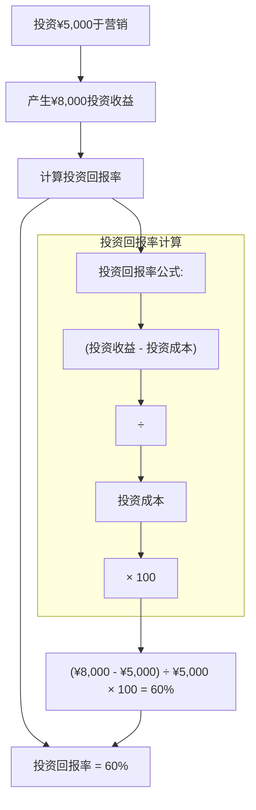

# 商业计算公式

1. **净收入**
- 对于判断企业经营状况至关重要。
- 显示收入与支出之间的差额。
- 净收入也被称为净利润、净盈利或企业底线。
- 如果净收入为负，则称为净亏损。

$$
净收入 =（收入 - 支出）
$$

1. **会计等式**
- 显示企业通过债务和股权融资的资产比例。
- 企业资产是企业拥有的有价值的物品。
- 负债是企业所欠的债务或已支出的费用。
- 企业权益是你在企业中拥有的所有权。

$$
资产 = 负债 + 权益
$$

如果资产不等于负债和权益的总和，可以通过操作等式来找出资产和负债之间的差异：

$$
权益 = 资产 - 负债
$$

权益，也称为股东权益（或私营公司的所有者权益），代表在公司清算的情况下，如果所有资产被变现并且公司的所有债务都被偿还后，将返还给公司股东的金额。在收购的情况下，它是公司销售价值减去未随销售转移的公司所欠的任何负债。

另一个重要的商业计算是毛利率。这个指标显示了超过销售成本的收入百分比。它使用以下公式计算：

$$
毛利率 =（收入 - 销售成本）/ 收入 × 100%
$$

1. **投资回报率**
- 要了解企业如何有效投资资金，可以计算企业的投资回报率（ROI）百分比。

$$
投资回报率 =［（投资收益 - 投资成本）/ 投资成本］× 100
$$

这个公式帮助企业评估其投资的效率。正的ROI表示投资有利可图，而负的ROI表示亏损。需要注意的是，ROI并不考虑货币的时间价值或风险因素，因此应该与其他财务指标一起使用，以进行全面分析。

)

1. **利润率**

利润率是一个关键的财务指标，显示公司每生成一美元收入能获得多少利润，反映了其在销售中管理成本的效率，并表明总体盈利能力。更高的利润率表明公司盈利能力更强，成本控制有效，这对希望了解公司在支付所有费用后能保留多少销售收入的投资者至关重要。计算利润率的公式为：

$$
\text{利润率} = \left( \frac{\text{净利润}}{\text{总收入}} \right) \times 100
$$

其中，净利润是总收入减去总支出。例如，如果一家公司净利润为 $50,000，总收入为 $200,000，则其利润率为 25%，意味着它每产生一美元收入可以保留 25 美分的利润。

1. **加价**

加价是指为了覆盖间接费用和利润而在商品成本价上增加的金额，以成本的百分比表示，这有助于企业确定销售价格。它对于确保公司覆盖成本并获得利润至关重要，理解加价可以使企业有效管理定价，以保持竞争力。加价的公式为：

$$
\text{加价} = \left( \frac{\text{售价} - \text{成本}}{\text{成本}} \right) \times 100
$$

例如，如果一种产品的成本为 $20，售价为 $30，则加价为 50%，这表明企业在成本上增加了 50% 的加价以实现利润。

1. **流动比率**

流动比率是一个流动性比率，衡量公司使用其短期资产偿还短期债务的能力，是财务健康的重要指标。更高的流动比率表明强大的流动性位置，暗示公司能够轻松满足其短期负债，这有助于投资者和债权人评估违约风险。流动比率的公式为：

$$
\text{流动比率} = \frac{\text{流动负债}}{\text{流动资产}}
$$

其中，流动资产预计将在一年内转化为现金，流动负债是预计将在一年内结清的义务。例如，如果一家公司流动资产为 $150,000，流动负债为 $100,000，则其流动比率为 1.5，意味着每 $1.00 的流动负债有 $1.50 的流动资产，表明健康的流动性状况。
